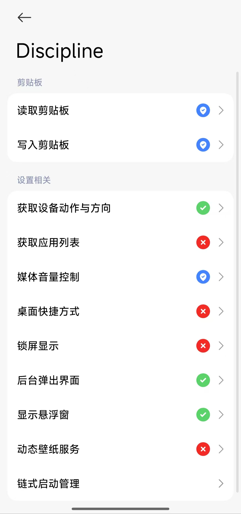
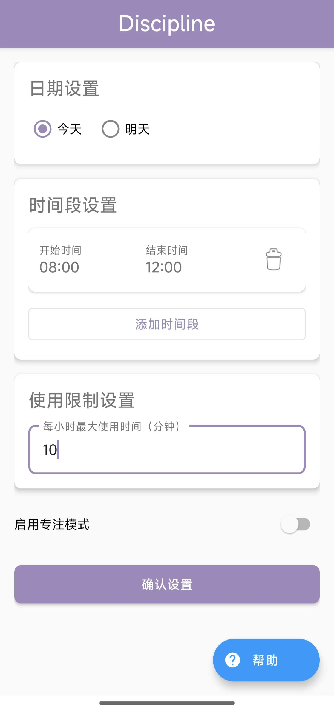
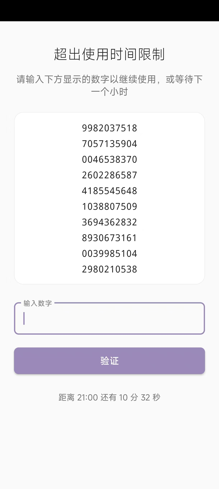

# Discipline - 让专注成为习惯

Discipline 是一个帮助用户保持专注的软件，源于我在备战考研过程中的真实需求。当我发现自己总是被手机打扰，无法专心学习时，我开发了这个工具。

## 软件功能
- 可以设置软件运行的时间段
- 监控屏幕使用时间
- 超过设定时长自动锁屏
- 每个整小时重置限制
- 只能通过输入100位随机数或等待下个整点解锁

## 使用前准备
除了软件自动索要的权限，还需要主动打开应用权限，并打开：，
1. 管理员权限
2. 后台弹出界面
3. 显示悬浮窗
4. 后台运行权限

  

 

## 使用方法
1. 在设置中开启所需权限
2. 选择好软件限制的时间段
3. 设置每小时最大使用时间
4. 启动专注模式按钮

  

  

## 注意事项
- 软件会强制锁屏，请确保及时保存工作内容
- 解锁非常困难，这是有意为之
- 建议先熟悉软件功能再正式使用
- 如果你觉得自己很自律，那就没有必要下载此软件
- 此软件还在测试，可能功能有不齐全的地方，欢迎向我反馈！

## 联系方式
如遇问题或建议，欢迎联系：
- 邮箱：[zl2628428766@gmail.com]
---
如果这个软件对你有帮助，欢迎打赏支持 ☕

    

